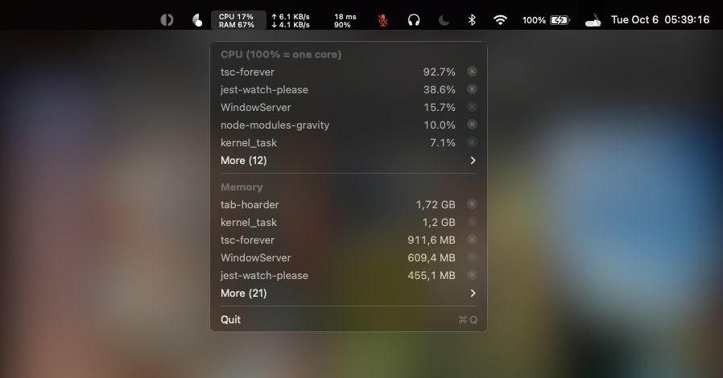
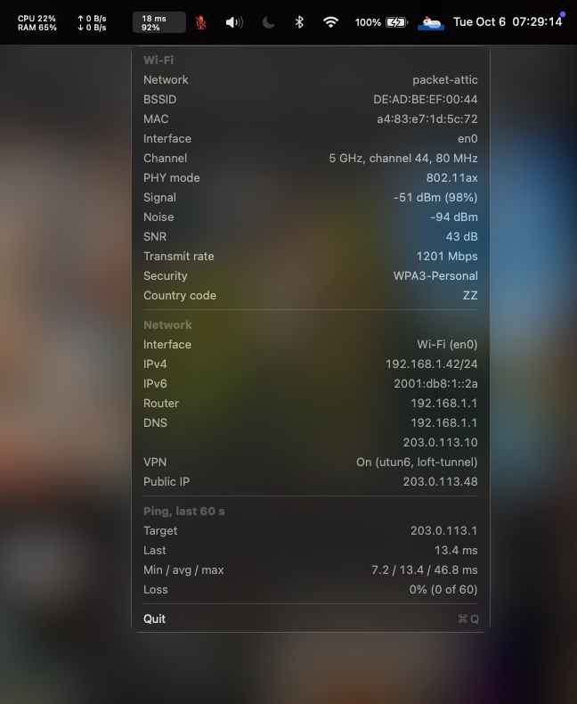
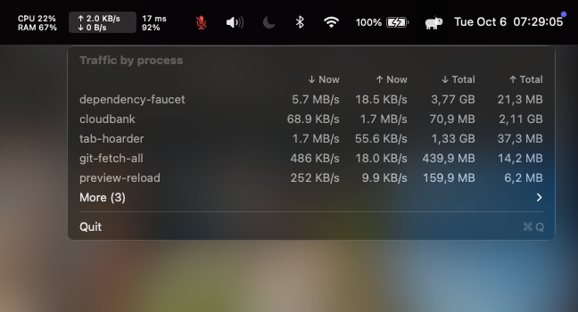

# capybar

<!-- cover: docs/cpu.png -->
<!-- date: 2026-10-06T02:00:00Z -->

**A capybara and her retinue in the macOS menu bar: CPU and memory, network throughput, ping and Wi-Fi, and the microphone.**

[](https://github.com/illinifellow/capybar/actions/workflows/ci.yml)
[](LICENSE)
[](https://www.apple.com/macos/)
[](https://buymeacoffee.com/illinifellow)



The menu bar is never out of sight, yet it is spent on matters consulted twice a day. capybar puts there what a gentleman at work actually glances at: the load on the machine, the traffic, the line and the microphone, each red only when it matters and each naming the culprit upon a click. The capybara came last and declined to leave.



## Of How the Thing Is Built

One native Swift program with four status items and a panel, admitted at login by a launch agent, reading the system directly and redrawing only what changed.

*Being a Brief and Respectful Account of a Small Rodent of Quality, Lately Elevated to the macOS Menu Bar, Together with Such Instruments of Measurement as Befit Her Retinue.*

## I. Of the Establishment, and Why It Exists at All

The menu bar had been given over to persons of no particular breeding: a clock, a battery, icons nobody recalls admitting. Into this company comes a capybara with four practical attendants, the household living in one process, as a respectable household ought. From left to right, the capybara beside the clock:

1. **The Constitution**: CPU above, memory used below (Activity Monitor's *Memory Used*), each second; red at CPU 85% or memory 90%. A click lists the top five processes by CPU and by memory, grouped by name, the next forty under *More* with its count. Each row's cross force-quits every process of that name, without the interview; it acts on the processes named when pressed, each re-identified first, so a reordering list cannot send the wrong guest to the door. Crosses are greyed for other users' processes and for `loginwindow`, `launchd` and `WindowServer`, whose departure ends the session. The open list refreshes each second from a separate thread.
2. **The Network**: upload above, download below, every 500 ms, counting physical interfaces (`en*`) only, so a VPN cannot claim traffic twice. A click lists each process's current and total traffic both ways, busiest first, the rest under *More*, fed by `nettop` each second while open; until fresh figures arrive, old rows show with a dash for rates, yesterday's gossip not being passed off as today's.

   

3. **The Ping**: round-trip to `8.8.8.8` above, Wi-Fi quality below (−100 dBm = 0%, −50 dBm or better = 100%), each second, via capybar's own ICMP socket. No reply within a second, or one over 150 ms, turns the ping red, as one raises an eyebrow at a footman late with the tea; quality turns red below 50% or without Wi-Fi. A click lays out the connection: network, channel, band, PHY mode, signal, noise, SNR, transmit rate, security, country; interface, IPv4, IPv6, router, DNS, VPN, public address; the last minute's pings with min, average, max and losses. Clicking any figure copies it (*Copied*). macOS withholds the BSSID from an unbundled program, and capybar says so; the network name comes from `system_profiler` once per network; the public address from `api.ipify.org`, kept five minutes or until the network changes.

4. **The Microphone**: crossed out and red when the default input is muted. Each press of the keyboard's microphone key toggles it, and nothing else may: capybar remaps the key to F5 with `hidutil` (ending macOS's Dictation prompts), catches it, and listens to the device, restoring at once any state another party alters. Each device is governed through one control, its mute switch where settable, else its volume, so the icon never claims a silence it cannot enforce; a muted volume's level is remembered per device and restored, and a device with neither control says so in the tooltip. The microphone is muted at every start, wake and unlock, unless at unlock the key last unmuted it and an application is listening, a call that outlasted a locked screen not being silenced behind its owner's back.
5. **The Capybara** sits in a borderless panel over the Control Center icon, hiding it (Control Center is then reached through System Settings) and following it. She walks, chews grass, reclines with a red apple on her head, sleeps in a procession of *z*s, stands in the rain and swims, apple in place, at eight frames a second; she is not to be hurried. Finding that icon requires Screen Recording; denied it, she queues among the others without complaint. A left click brings forward the iTerm2 session running Claude Code (process `claude`), or opens a window running `claude`, or the command set with `defaults write capybar claudeCodeCommand '…'`; without iTerm2 she merely looks up. A right click offers *Quit*. On the first summons macOS asks whether `capybar` may control iTerm2; answer *Allow*, unless one prefers the life of a lighthouse keeper, whose only correspondent is the sea.

## II. Of Installation, Which Requires No Great Talent

You require macOS and the Swift compiler of the Xcode Command Line Tools. Those lacking both are advised to take up antique barometers, which likewise concern pressure, at a more forgiving pace.

```bash
git clone https://github.com/illinifellow/capybar.git
cd capybar
./install.sh
```

`install.sh` builds `Sources/` beside `~/.local/bin/capybar`, signs it, and only then replaces the old binary, so a failed build changes nothing. It registers the launchd agent `com.illinifellow.capybar`, which starts at login and returns after a crash (a deliberate *Quit* is respected). Rerun it to rebuild and restart; `./install.sh 0.2.0` refuses a build reporting any other version.

A newer release puts *Update to X.Y.Z* beside *Quit* in every menu. It fetches that release and runs its `install.sh` for exactly that version; if a step before the replacement fails, the old capybar stays and a notice names the step. Releases are checked at start and every six hours. Hand alterations to the sources are, naturally, replaced.

To dismiss the household, its key remaps, preferences and earlier versions' leavings:

```bash
./uninstall.sh
```

*Quit* in any item's menu (the capybara's right-click menu) closes the whole household, which dines as one, and returns the microphone and moon keys to macOS; logging out does the same. They return at the next login.

## III. Of Certain Services Rendered Without Ceremony

- **Cmd+\\** opens the screenshot toolbar on a selected area and copies the result; **Cmd+Shift+\\** sends it to Preview, the file left in the temporary directory macOS sweeps. Without Screen Recording permission captures hold only the wallpaper. The system screenshot shortcuts must stay on their defaults, lest they claim the backslash first.
- The moon key becomes F6 and toggles Do Not Disturb through the shortcut «Toggle Do Not Disturb», imported once from `extras/Toggle Do Not Disturb.shortcut` (open it, press *Add Shortcut*); macOS offers no public means otherwise. A held key counts once, as for every key capybar keeps.
- While capybar runs, Cmd+\\, Cmd+Shift+\\, F5 and F6 are its own in every application; whoever relies on them must make other arrangements.
- `install.sh` signs with the identity `capybar local signing` when the keychain holds one, so macOS remembers these permissions across rebuilds.

## IV. Of Instructions Given from the Command Line

| Command                       | Effect                                                    |
| ----------------------------- | --------------------------------------------------------- |
| `capybar`                     | Runs the household (what the launchd agent does at login) |
| `capybar --version`           | Prints the version                                        |
| `capybar --focus-claude-code` | Does what a left click on the capybara does               |
| `capybar --remove-key-remaps` | Returns the microphone and moon keys to macOS             |

Whatever capybar finds amiss it enters quietly in the unified log: `log show --last 1h --predicate 'subsystem == "com.illinifellow.capybar"'`.

## V. Of the Arrangement of the Sources

| File                        | Responsibility                                                             |
| --------------------------- | -------------------------------------------------------------------------- |
| `Sources/main.swift`        | Start-up, the four items and the capybara, the command line                |
| `Sources/shared.swift`      | Quit menu, timers, label colour, two-line inscription, global hotkeys      |
| `Sources/menu.swift`        | Shared rows, sections, crosses and Quit entry; the open-menu refresh timer |
| `Sources/command.swift`     | Running other programs; the log                                            |
| `Sources/version.swift`     | The version, declared here alone, and version comparison                   |
| `Sources/update.swift`      | Finding a newer release and running its `install.sh`                       |
| `Sources/ping.swift`        | The ping and Wi-Fi item and its account of the connection                  |
| `Sources/icmp.swift`        | The echo request and its reply                                             |
| `Sources/capybara.swift`    | The capybara, her activities, apple, weather and place in the bar          |
| `Sources/claudecode.swift`  | Her errand to iTerm2 for Claude Code                                       |
| `Sources/network.swift`     | Interface counters and the upload and download item                        |
| `Sources/system.swift`      | CPU ticks, memory statistics and their item                                |
| `Sources/counters.swift`    | Counters that wrap or reset                                                |
| `Sources/format.swift`      | Rates and sizes                                                            |
| `Sources/processes.swift`   | Sampling through `ps` and `nettop`; the force quit                         |
| `Sources/usage.swift`       | Reading the samples, grouping by name, folding under More                  |
| `Sources/microphone.swift`  | The microphone item and the mute guard                                     |
| `Sources/mutecontrol.swift` | Choosing the control a device is muted through                             |
| `Sources/keymap.swift`      | The `hidutil` remaps of the microphone and moon keys                       |
| `Sources/hotkeys.swift`     | Screenshot hotkeys and their `screencapture`                               |
| `Sources/focus.swift`       | Do Not Disturb on the moon key                                             |
| `Tests/main.swift`          | Tests of everything that needs no menu bar                                 |

Thresholds, intervals and the ping host are constants at the head of each file. Alter them there, run `./install.sh`, and the next update, built from the published sources, will undo the alteration with perfect courtesy.

## VI. Of Improvements, and the Proper Manner of Proposing Them

Every change begins as a [bug report](https://github.com/illinifellow/capybar/issues/new?template=bug_report.yml) or a [feature request](https://github.com/illinifellow/capybar/issues/new?template=feature_request.yml), proceeds on a branch from `develop`, and arrives by a pull request into `develop` that closes it; the branch is removed on merge, as a guest's coat is returned at the door. Releases merge `develop` into `master` under a tag of the version in `Sources/version.swift`, without the vulgar «v»; CI refuses a pull request into `master` that does not raise it, and a tag that disagrees.

To build and test without installing, as CI does:

```bash
mkdir -p .build
swiftc -O Sources/*.swift -o .build/capybar
swiftc $(ls Sources/*.swift | grep -v main.swift) Tests/main.swift -o .build/tests && .build/tests
```

## VII. Of Licence

MIT. Do with it very nearly as you please, provided you do not mistake the capybara for a hippopotamus in polite company.
